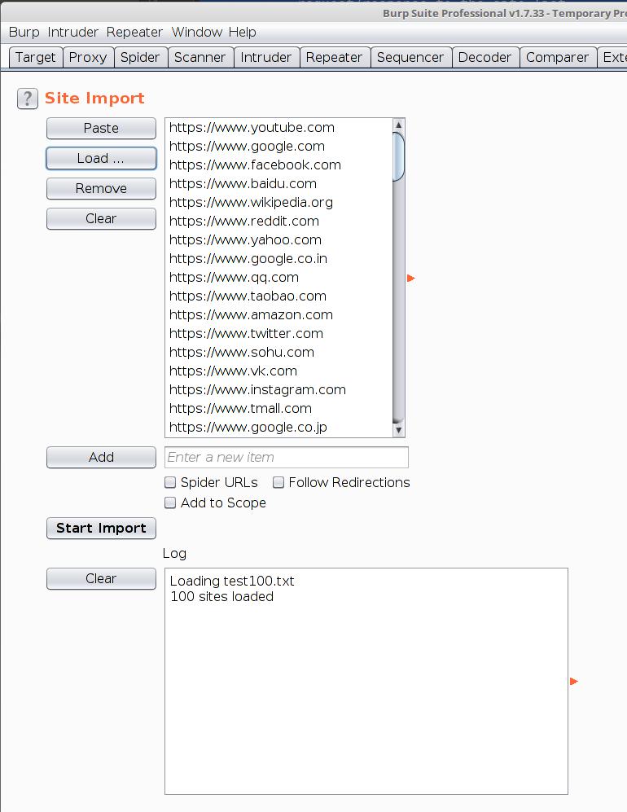
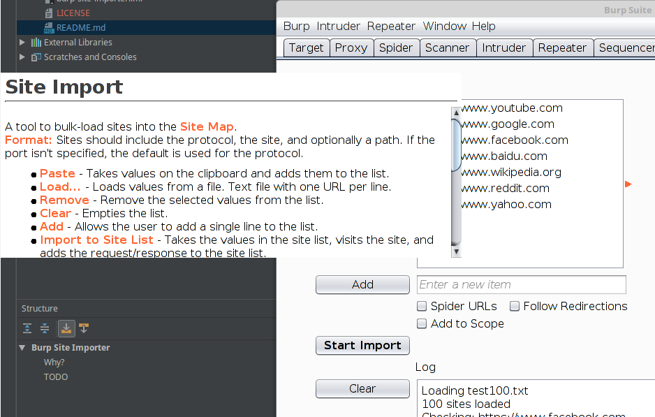
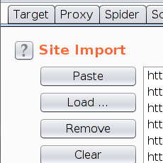

# Burp Site Importer
Burp extension to read files from various files, connect to them, and import the information into the Site window. On a successful connection, further operations can be performed.

Current formats include:
* Text
* Nmap XML
* OpenVAS XML
* Nessus

Post-connection options include:
* Follow redirects
* Add to Scope
* Start spidering each site

## Why?
I'm a .NET dev by trade so wanted to stretch my skills with some Java until we get .NET Core bindings for Burp (HINT) ;) 

A similar tool had been written in Python a couple of years ago but hasn't been updated since - https://github.com/dipsylala/Burp-Importer. It had some shortcomings, I needed the practice... and here we are.
This one's multithreaded, non-blocking and I've designed the import to be open to extension. Filetype detection is typically based on format detection, with only text format relying on a txt extension.

In writing this, I coded up some reusable components for a similar Look and Feel to Burp:

* BurpPopupHelp - display a dialog similar to the help in Burp

* JBurpHelpButton - a button with a ? in the middle

* JBurpPlaceholderTextField - a textfield with italic placeholder text

* JBurpSplitPane - a split pane with the orange triangle divider used in Burp.

## TODO
More imports formats - the more the merrier.
Better reporting
Anything else we can start doing once we've imported the sites?
Make more components - eg the title/help button can probably be made into one component
